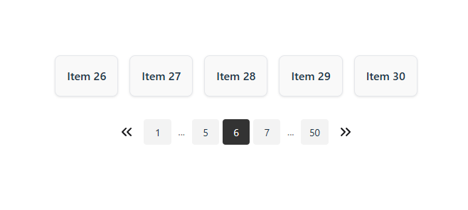

# pagination-ross

Un componente de paginación para React, fácil de usar y personalizable.

## Instalación

```bash
npm install pagination-ross
```

## Uso básico

```tsx
import Pagination from "pagination-ross";
function App() {
  return (
    <Pagination
      currentPage={3}
      totalPages={10}
      onPageChange={(page) => console.log("Nueva página:", page)}
    />
  );
}
```

## 🔗 Demo y ejemplo

<ul>
  <li>💻 Demo en vivo: <a href="https://pagination-ross-demo.pages.dev/" target="_blank">https://pagination-ross-demo.pages.dev/</a></li>
  <li>📁 Código del demo: <a href="https://github.com/Ross1736/pagination-ross-demo.git" target="_blank">https://github.com/Ross1736/pagination-ross-demo.git</a></li>
</ul>



## Props

| Propiedad           | Tipo                   | Requerido | Descripción                                                       |
| ------------------- | ---------------------- | --------- | ----------------------------------------------------------------- |
| currentPage         | number                 | Sí        | Página actual que está siendo visualizada.                        |
| totalPages          | number                 | Sí        | Número total de páginas disponibles.                              |
| onPageChange        | (page: number) => void | No        | Callback que se ejecuta al cambiar de página.                     |
| className           | string                 | No        | Clase CSS para el contenedor principal.                           |
| style               | React.CSSProperties    | No        | Estilos en línea para el contenedor principal.                    |
| colorIcon           | string                 | No        | Color de los íconos de navegación. Por defecto: "#18181b".        |
| buttonClassName     | string                 | No        | Clase CSS para los botones de navegación (anterior/siguiente).    |
| listClassName       | string                 | No        | Clase CSS para el `<ul>` que contiene los botones de página.      |
| itemClassName       | string                 | No        | Clase CSS para cada ítem de paginación (`<li>`).                  |
| activeItemClassName | string                 | No        | Clase CSS para el ítem activo (página actual).                    |
| ellipsisClassName   | string                 | No        | Clase CSS para los ítems que muestran puntos suspensivos ("..."). |

## Ejemplo de lógica de paginación

Aquí tienes una lógica básica para paginar tu lista de ítems:

```tsx
const itemsPerPage = 5;
const currentPage = Number(page); // page index empieza en 1

// Calcular total de páginas
const totalItems = listItems.length;
const totalPages = Math.ceil(totalItems / itemsPerPage);

// Obtener los ítems de la página actual
const startIndex = (currentPage - 1) * itemsPerPage;
const endIndex = startIndex + itemsPerPage;
const currentItems = listItems.slice(startIndex, endIndex);

// Manejador para cambiar de página
function handleClick(page: number) {
  console.log(String(page));
}
```

Puedes combinar esto con el componente:

```tsx
<Pagination
  currentPage={1}
  totalPages={5}
  onPageChange={handleClick}
  buttonClassName="buttonClass"
  listClassName="listClass"
  itemClassName="itemClass"
  activeItemClassName="activeItemClass"
  ellipsisClassName="ellipsisClass"
/>
```

## Licencia

MIT
